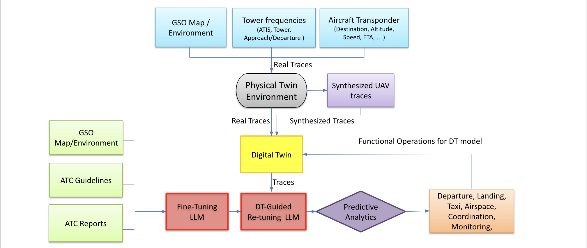

# ATC_DT



# Step 1: Install Dependencies

In the "kgso_extractor_v13.py" python file, which in the generation of ADSB data, you will need to use the following libraries:
```python
import gzip
import requests
from math import radians, sin, cos, sqrt, atan2
import json
import csv
```

You will need to install the packages for each library. Here is a list of necessary commands for installation:
<pre>
!pip install requests
!pip install gzip
!pip install json
</pre>

Similarly, you will need to use the following libraries in the "ATC_SIM_v_main.ipynb" python file, which is used to create your Digital Twin(DT) data and ATC visualization:

```python
import pandas as pd
import numpy as np
import time as tm
import csv
from datetime import datetime, timedelta, time
import os
from collections import Counter
import json
import matplotlib.pyplot as plt
import contextily as ctx
import geopandas as gpd
from shapely.geometry import Point
import matplotlib.image as mpimg
from matplotlib.offsetbox import OffsetImage, AnnotationBbox
from matplotlib.transforms import Affine2D
from scipy.ndimage import rotate
from shapely.geometry import LineString
```

Here is a command listing the necessary packages for installation:

<pre> !pip install pandas numpy matplotlib contextily geopandas shapely scipy </pre>

# Step 2: Generation of ADSB Data

In order to create your DT csv file, you will need to first create an ADSB csv file to extract data from.

1. "readsb-hist" is an online histoircal data source that is used to extract a full CSV containing ATC data from multiple dates and times. The objective of the "kgso_extractor_v13.py" script is to extract specific date and time segments of this CSV, creating the ADSB data generated in this step.

2. Follow this link the "readsb-hist" data source: https://samples.adsbexchange.com/

3. Download the "readsb-hist" folder and store it in your project folder.
  
4.  We will be extracting from this folder to create the "aircraft_near_KGSO.csv" file located in this github. Adjust your "csv_path" variable in the "kgso_extractor_v13.py" code to direct to the location that you saved the "readsb-hist" to.
   
5. Once you run your code, "aircraft_near_KGSO.csv" should show up in your folder. Ensure that the file is in the same directory as your python file, "kgso_extractor_v13.py".

6. Locate this line: "url = f"https://samples.adsbexchange.com/readsb-hist/2024/06/01/{time_str}.json.gz"" at the bottom of the kgso_extractor_v13 python file and adjust the date in the URL to your desired date for extraction.

These steps will help you create the ADSB data csv similar to the format of the "adsb_hist_06_01_24_cleaned.csv" shown in this repo.

# Step 3: Generation of Operations Data

Part of the DT csv file creation also involves the operational flight data that you will need to extract. you will need to need create an operations csv file to extract data from.

1. Navigate to the following link and select the date you wish to extract your data for: https://samples.adsbexchange.com/index.html#operations-ax-v2. The csv should look like: operations.csv.gz

2. Once this is downloaded, you will need to put this file in your working ATC_DT directory. After doing this, in the operations_extract.py python file, make sure the "input_csv" variable at the top of the file matches the file name you have just downloaded.

3. Next, run the code. It will output a file called "KGSO_operations_output.csv".
  
4.  Once you have this file in your working directory, you will be ready to use it in your "ATC_SIM_v_main_final.ipynb" code.

# Step 4: Generation of DT Visualization and CSV Data

Once you have the ADSB data csv, you can move on to generating the aircraft visualization and DT CSV data.

1. Ensure that these files are all in the same directory: new_freq_filesWAV2TXT - KGSO_ATIS 2_reformatted_with_final_times_VID.csv, new_freq_filesWAV2TXT - KGSO_Approach_Departure 2_reformatted_with_final_times_VID.csv, new_freq_filesWAV2TXT - KGSO_TOWER 2_reformatted_with_final_times_VID.csv, synthetic.json, ATC_SIM_v_main.ipynb, and your ADSB CSV.
   
2. In the "ATC_SIM_v_main.ipynb" python file, locate the transcription file list and adjust the files paths based on your own directory:
   ```python
   transcription_files = [
        '/Users/naimbaker/Documents/ATC/new_freq_filesWAV2TXT - KGSO_ATIS 2_reformatted_with_final_times_VID.csv',
        '/Users/naimbaker/Documents/ATC/new_freq_filesWAV2TXT - KGSO_Approach_Departure 2_reformatted_with_final_times_VID.csv',
        '/Users/naimbaker/Documents/ATC/new_freq_filesWAV2TXT - KGSO_TOWER 2_reformatted_with_final_times_VID.csv'
    ]
    ```
    
3. Locate the "csv_file" variable a few lines below the transcription file list and adjust it to the path of your ADSB CSV.

4. Locate the "output_path" variable and adjust to the directory you are working in.

5. Create a folder called "ATC Aircraft Maps" in the same directory.

Your file setup is now complete. Run your DT code and follow the directions of the text entries to create your visualization and DT data response.
